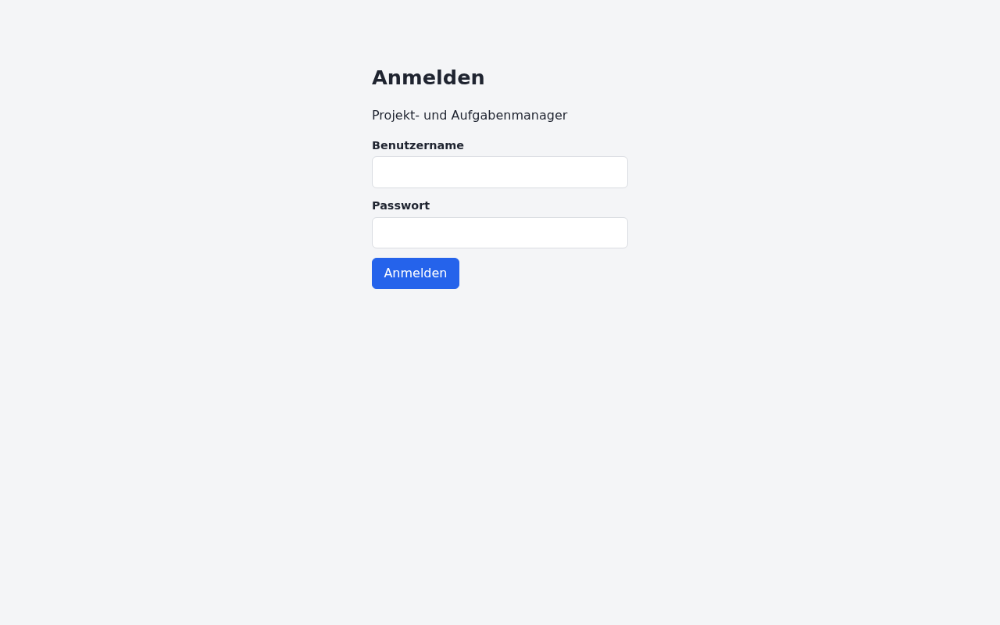
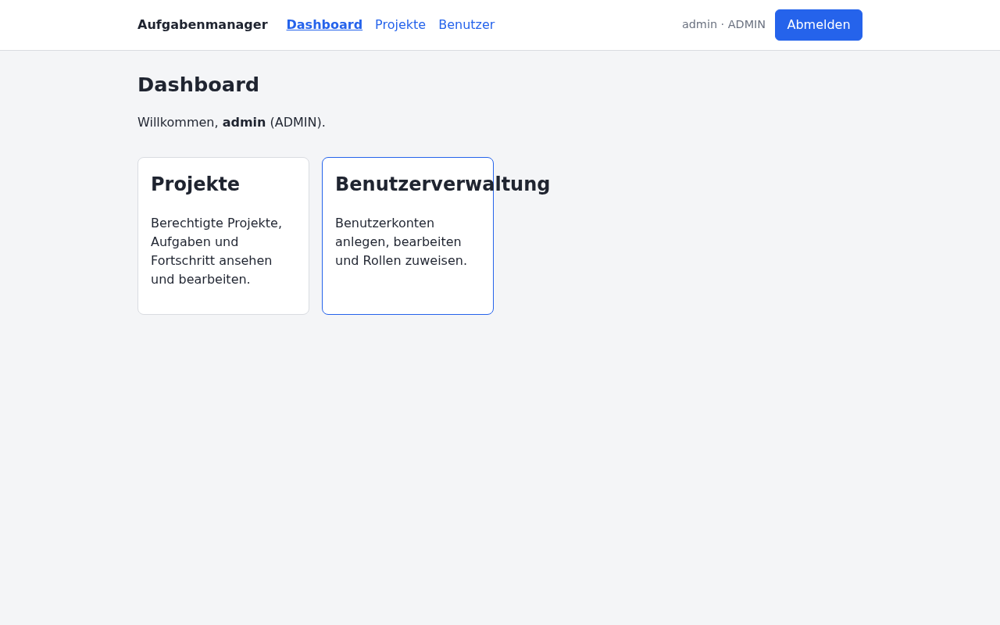
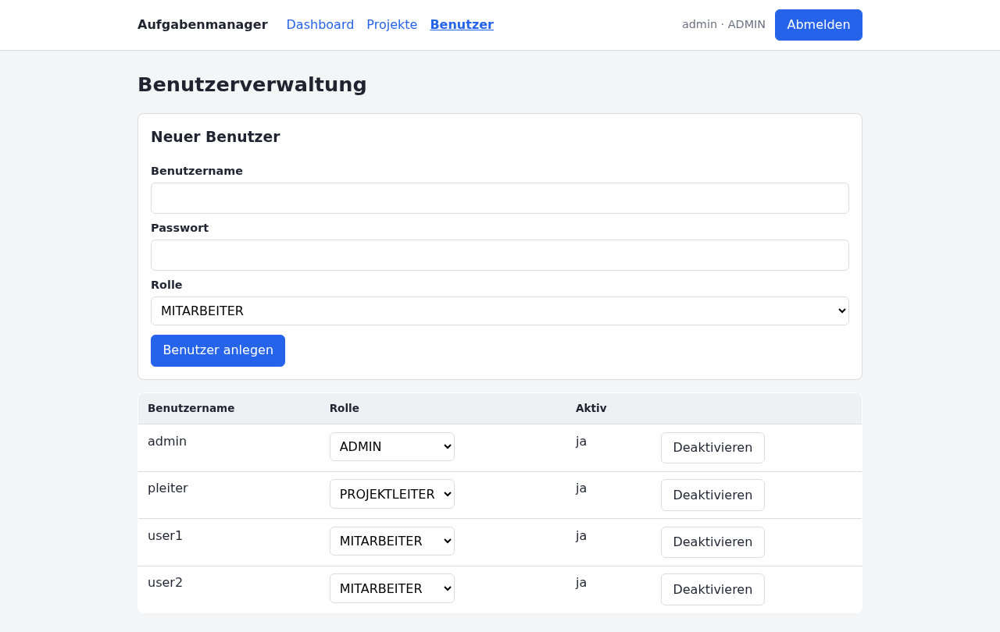
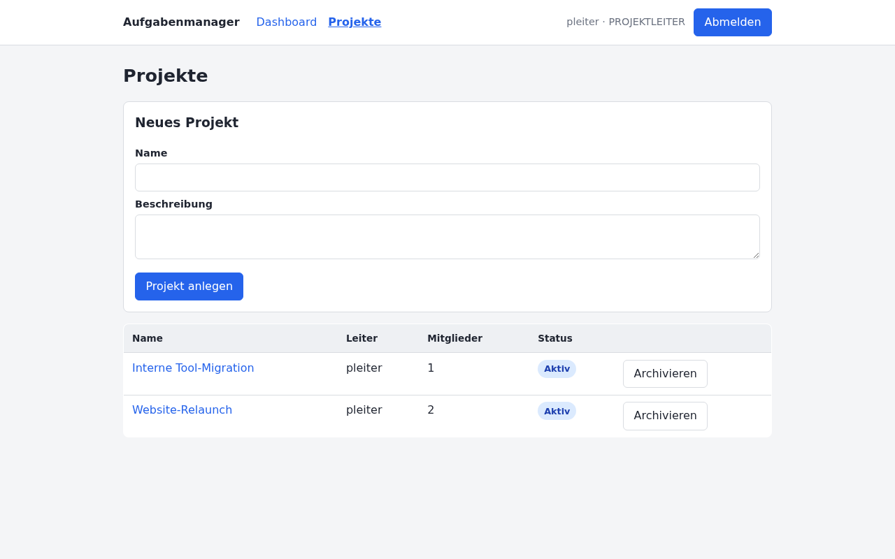
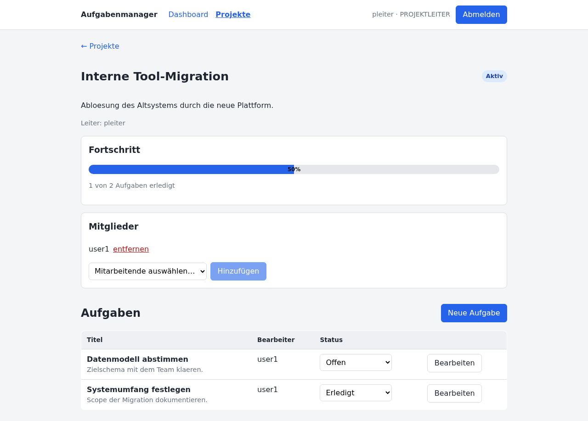

# projekt-aufgabenmanager

Webbasiertes Projekt- und Aufgabenmanagementsystem für ein IT-Dienstleistungsunternehmen.
Studentisches Prüfungsprojekt (Fallstudie) im Kurs *Programmierung von Web-Anwendungen*, IU.

## Funktionen
- Benutzer- und Rollenverwaltung (Admin, Projektleiter, Mitarbeitende)
- Projekte anlegen, bearbeiten, archivieren
- Mitarbeitende Projekten zuordnen
- Aufgaben erstellen/bearbeiten und Status ändern (offen / in Bearbeitung / erledigt)
- Projektfortschritt anhand erledigter Aufgaben
- Login/Logout, berechtigungsbasierte Projektsicht

## Technologiestack
- Backend: Java 21, Spring Boot 3, Spring Security (JWT), Spring Data JPA/Hibernate
- Datenbank: H2 (Datei-Modus)
- Frontend: React (Vite, TypeScript)
- Tests: JUnit 5, Spring Boot Test/MockMvc, Vitest + React Testing Library

## Projektstruktur
- `backend/`  – Spring-Boot-Anwendung (REST-API)
- `frontend/` – React-SPA
- `docs/`     – ER-Diagramm, UML, Architektur, Navigation, Screenshots

## Setup & Start
### Backend
```bash
cd backend
./mvnw spring-boot:run     # ohne lokale Maven-Installation (Maven Wrapper)
# alternativ, falls Maven installiert ist: mvn spring-boot:run
# API unter http://localhost:8080
```
Voraussetzung: JDK 21. Der Maven Wrapper (`./mvnw`) lädt Maven automatisch.
### Frontend
```bash
cd frontend
npm install
npm run dev
# UI unter http://localhost:5173
```
Der Dev-Server läuft auf Port **5173** (in der CORS-Konfiguration des Backends erlaubt) und
leitet `/api`-Aufrufe per Proxy an das Backend auf Port 8080 weiter.

## Testzugänge (Seed-Daten)
Werden beim ersten Start automatisch angelegt (`DataSeeder`). Nur für die lokale Demo.

| Rolle | Benutzer | Passwort |
|---|---|---|
| Administrator | admin | admin123 |
| Projektleiter | pleiter | pleiter123 |
| Mitarbeitende | user1 | user123 |
| Mitarbeitende | user2 | user123 |

## Tests ausführen
```bash
cd backend && ./mvnw test
cd frontend && npm test
```

## Screenshots
Anmeldung, rollenabhängiges Dashboard, Benutzerverwaltung, Projektliste und Projektdetail
(mit Fortschrittsbalken). Erzeugt auf den Seed-Daten.

| | |
|---|---|
| **Login** | **Dashboard (Admin)** |
|  |  |
| **Benutzerverwaltung** | **Projektliste** |
|  |  |

**Projektdetail (Fortschritt, Mitglieder, Aufgaben)**



## Dokumentation & Diagramme
Im Ordner `docs/` (Mermaid, auf GitHub direkt gerendert):
- [ER-Diagramm](docs/er-diagramm.md)
- [UML-Klassendiagramm](docs/uml-klassendiagramm.md)
- [Architektur](docs/architektur.md)
- [Navigation](docs/navigation.md)

## Hinweis
Studentisches Projekt im Rahmen einer Prüfungsleistung an der IU Internationalen Hochschule.
