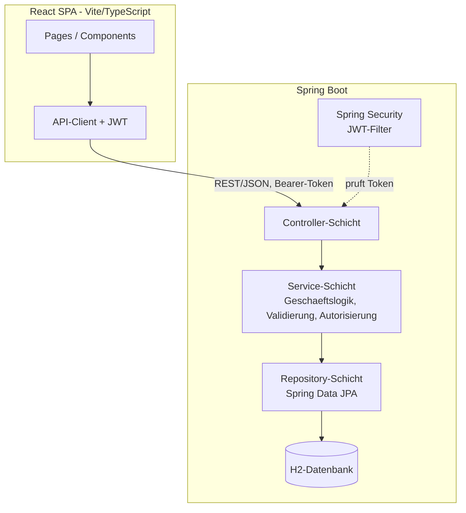

# Architektur

React-SPA gegen eine zustandslose Spring-Boot-REST-API. Backend strikt 3-schichtig
(Controller → Service → Repository); Autorisierung zweistufig: grobe Rollen-Gates per
`@PreAuthorize` in den Controllern, feine Eigentümer-/Mitgliedschaftsprüfung in den Services.
Authentifizierung über JWT (Bearer-Token).

