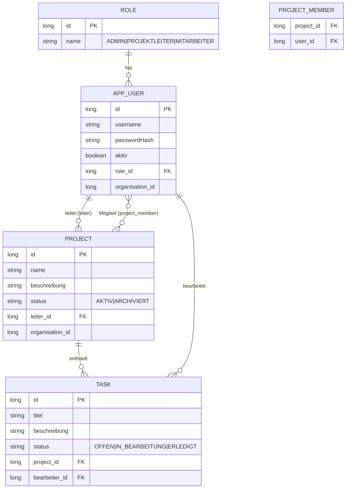

# ER-Diagramm

Datenmodell des Aufgabenmanagers (wie im Backend umgesetzt). Tabellenname `app_user`,
da `user` in vielen Datenbanken reserviert ist; die n:m-Zuordnung Mitglied liegt in der
Join-Tabelle `project_member`. `organisation_id` ist zur Mandantenvorbereitung vorhanden
(ein aktiver Mandant, Default 1).

