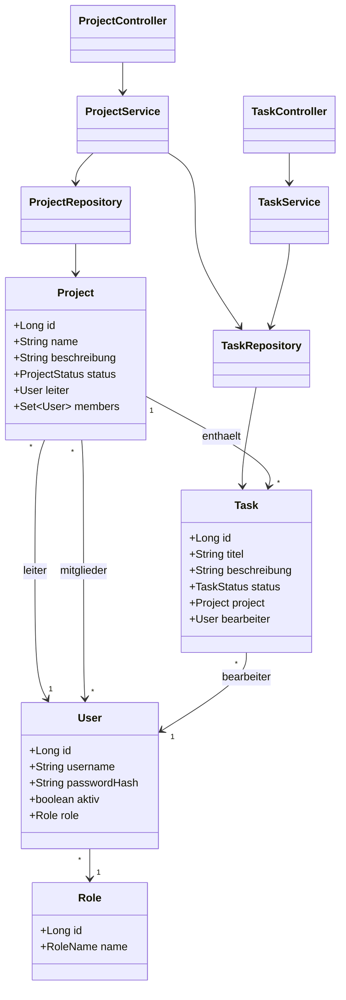

# UML-Klassendiagramm (Backend-Kern)

Vereinfachtes Klassendiagramm der Backend-Kernklassen: 3-Schichten-Architektur
(Controller → Service → Repository) mit den Entities des Datenmodells.

```mermaid
classDiagram
  class ProjectController
  class ProjectService
  class ProjectRepository
  class TaskController
  class TaskService
  class TaskRepository

  class Project {
    +Long id
    +String name
    +String beschreibung
    +ProjectStatus status
    +User leiter
    +Set~User~ members
  }
  class Task {
    +Long id
    +String titel
    +String beschreibung
    +TaskStatus status
    +Project project
    +User bearbeiter
  }
  class User {
    +Long id
    +String username
    +String passwordHash
    +boolean aktiv
    +Role role
  }
  class Role {
    +Long id
    +RoleName name
  }

  ProjectController --> ProjectService
  ProjectService --> ProjectRepository
  ProjectService --> TaskRepository
  TaskController --> TaskService
  TaskService --> TaskRepository
  ProjectRepository --> Project
  TaskRepository --> Task
  Project "1" --> "*" Task : enthaelt
  Project "*" --> "1" User : leiter
  Project "*" --> "*" User : mitglieder
  Task "*" --> "1" User : bearbeiter
  User "*" --> "1" Role
```
